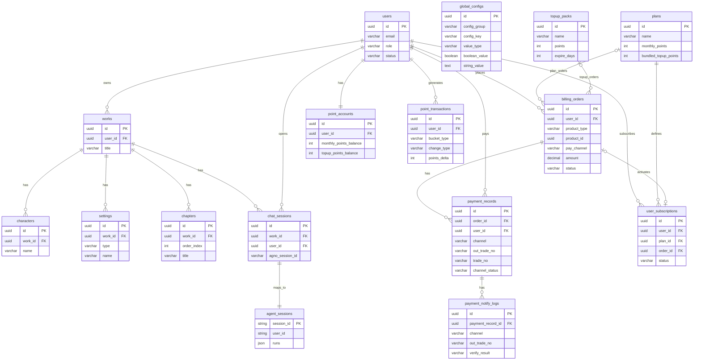

# 金番写作 MVP 数据库设计文档

**版本**：V1.4  
**文档类型**：数据库设计

## 一、设计范围

本文件只描述当前 MVP 的数据库结构，包括：

- 表
- 字段
- 索引
- 约束
- 删除策略
- 默认 seed 数据

当前版本对应的核心对象为：

- 用户
- 全局配置
- 作品
- 角色
- 设定
- 章节
- 会话
- 套餐
- 加油包
- 订单
- 支付记录
- 支付通知日志
- 订阅
- 积分账户
- 积分流水

## 二、实体关系



说明：

- `billing_orders` 通过 `product_type + product_id` 关联商品，因此它与 `plans`、`topup_packs` 是多态关系。
- `agent_sessions` 由 Agno Session Storage 管理，业务侧通过 `chat_sessions.agno_session_id` 与之关联。

## 三、表设计

### 3.1 `users`

用于保存用户和管理员账号信息。

| 字段名          | 类型            | 必填 | 说明                                 |
| :-------------- | :-------------- | :--- | :----------------------------------- |
| `id`            | `uuid`          | 是   | 主键                                 |
| `email`         | `varchar(200)`  | 是   | 登录邮箱                             |
| `password_hash` | `varchar(255)`  | 是   | 密码哈希                             |
| `nickname`      | `varchar(100)`  | 是   | 昵称                                 |
| `role`          | `varchar(20)`   | 是   | 角色，建议值：`user`、`admin`        |
| `status`        | `varchar(20)`   | 是   | 状态，建议值：`active`、`disabled`   |
| `last_login_at` | `timestamptz`   | 否   | 最近登录时间                         |
| `created_at`    | `timestamptz`   | 是   | 创建时间                             |
| `updated_at`    | `timestamptz`   | 是   | 更新时间                             |

约束建议：

- `unique(email)`

建议索引：

- `index_users_role`
- `index_users_status`

### 3.2 `global_configs`

用于保存全局配置项，支持不同类型字段。

| 字段名          | 类型            | 必填 | 说明                                                         |
| :-------------- | :-------------- | :--- | :----------------------------------------------------------- |
| `id`            | `uuid`          | 是   | 主键                                                         |
| `config_group`  | `varchar(100)`  | 是   | 配置分组，例如 `payment.alipay_f2f`                          |
| `config_key`    | `varchar(100)`  | 是   | 配置键，例如 `app_id`、`notify_url`                          |
| `value_type`    | `varchar(30)`   | 是   | 类型，建议值：`string`、`integer`、`decimal`、`boolean`、`json`、`secret` |
| `string_value`  | `text`          | 否   | 字符串值                                                     |
| `integer_value` | `bigint`        | 否   | 整数值                                                       |
| `decimal_value` | `decimal(18,6)` | 否   | 小数值                                                       |
| `boolean_value` | `boolean`       | 否   | 布尔值                                                       |
| `json_value`    | `jsonb`         | 否   | JSON 值                                                      |
| `description`   | `text`          | 否   | 配置说明                                                     |
| `is_required`   | `boolean`       | 是   | 是否必填                                                     |
| `created_at`    | `timestamptz`   | 是   | 创建时间                                                     |
| `updated_at`    | `timestamptz`   | 是   | 更新时间                                                     |

约束建议：

- `unique(config_group, config_key)`

建议索引：

- `index_global_configs_group`
- `index_global_configs_value_type`

### 3.3 `works`

用于保存作品基础信息和作品级总纲信息。

| 字段名                   | 类型            | 必填 | 说明                         |
| :----------------------- | :-------------- | :--- | :--------------------------- |
| `id`                     | `uuid`          | 是   | 主键                         |
| `user_id`                | `uuid`          | 是   | 所属用户 ID，关联 `users.id` |
| `title`                  | `varchar(200)`  | 是   | 作品名称                     |
| `short_intro`            | `text`          | 是   | 短简介                       |
| `synopsis`               | `text`          | 是   | 梗概                         |
| `genre_tags`             | `text[]`        | 是   | 题材标签，多值数组           |
| `background_rules`       | `text`          | 是   | 背景与世界规则               |
| `focus_requirements`     | `text`          | 否   | 重点要求                     |
| `forbidden_requirements` | `text`          | 否   | 禁忌要求                     |
| `created_at`             | `timestamptz`   | 是   | 创建时间                     |
| `updated_at`             | `timestamptz`   | 是   | 更新时间                     |

建议索引：

- `index_works_user_id`
- `index_works_updated_at`

### 3.4 `characters`

用于保存作品中的人物信息。

| 字段名       | 类型            | 必填 | 说明                         |
| :----------- | :-------------- | :--- | :--------------------------- |
| `id`         | `uuid`          | 是   | 主键                         |
| `work_id`    | `uuid`          | 是   | 所属作品 ID，关联 `works.id` |
| `name`       | `varchar(100)`  | 是   | 角色名称                     |
| `summary`    | `text`          | 是   | 角色简介                     |
| `detail`     | `text`          | 否   | 角色详情                     |
| `created_at` | `timestamptz`   | 是   | 创建时间                     |
| `updated_at` | `timestamptz`   | 是   | 更新时间                     |

建议索引：

- `index_characters_work_id`
- `index_characters_name`

### 3.5 `settings`

用于保存除角色外的设定信息。

| 字段名       | 类型            | 必填 | 说明                                                   |
| :----------- | :-------------- | :--- | :----------------------------------------------------- |
| `id`         | `uuid`          | 是   | 主键                                                   |
| `work_id`    | `uuid`          | 是   | 所属作品 ID，关联 `works.id`                           |
| `type`       | `varchar(50)`   | 是   | 设定类型，例如 `location`、`equipment`、`attribute` 等 |
| `name`       | `varchar(100)`  | 是   | 设定名称                                               |
| `summary`    | `text`          | 是   | 设定简介                                               |
| `detail`     | `text`          | 否   | 设定详情                                               |
| `created_at` | `timestamptz`   | 是   | 创建时间                                               |
| `updated_at` | `timestamptz`   | 是   | 更新时间                                               |

建议索引：

- `index_settings_work_id`
- `index_settings_type`
- `index_settings_name`

### 3.6 `chapters`

用于保存章节内容。

| 字段名        | 类型            | 必填 | 说明                         |
| :------------ | :-------------- | :--- | :--------------------------- |
| `id`          | `uuid`          | 是   | 主键                         |
| `work_id`     | `uuid`          | 是   | 所属作品 ID，关联 `works.id` |
| `order_index` | `integer`       | 是   | 章节顺序                     |
| `title`       | `varchar(200)`  | 是   | 章节标题                     |
| `content`     | `text`          | 是   | 章节正文                     |
| `summary`     | `text`          | 否   | 章节提要                     |
| `created_at`  | `timestamptz`   | 是   | 创建时间                     |
| `updated_at`  | `timestamptz`   | 是   | 更新时间                     |

约束建议：

- `unique(work_id, order_index)`

建议索引：

- `index_chapters_work_id`
- `index_chapters_order_index`

### 3.7 `chat_sessions`

用于保存业务侧会话索引信息。

| 字段名                 | 类型            | 必填 | 说明                               |
| :--------------------- | :-------------- | :--- | :--------------------------------- |
| `id`                   | `uuid`          | 是   | 主键                               |
| `work_id`              | `uuid`          | 是   | 所属作品 ID，关联 `works.id`       |
| `user_id`              | `uuid`          | 是   | 所属用户 ID，关联 `users.id`       |
| `agno_session_id`      | `varchar(100)`  | 是   | Agno Session ID                    |
| `title`                | `varchar(200)`  | 是   | 会话标题                           |
| `source_type`          | `varchar(30)`   | 是   | 会话来源，例如 `manual`、`editor`  |
| `last_message_preview` | `text`          | 否   | 最近一条消息预览                   |
| `last_active_at`       | `timestamptz`   | 是   | 最近活跃时间                       |
| `created_at`           | `timestamptz`   | 是   | 创建时间                           |
| `updated_at`           | `timestamptz`   | 是   | 更新时间                           |

约束建议：

- `unique(agno_session_id)`

建议索引：

- `index_chat_sessions_work_id`
- `index_chat_sessions_user_id`
- `index_chat_sessions_last_active_at`

### 3.8 `agent_sessions`

用于保存 Agno Session Storage 的会话数据。

建议在 Postgres 中使用自定义表名：

```python
db = PostgresDb(
    db_url="postgresql+psycopg://...",
    session_table="agent_sessions",
)
```

该表由 Agno 管理，业务侧通过 `agno_session_id` 与之关联。

### 3.9 `plans`

用于保存套餐商品。

| 字段名                  | 类型            | 必填 | 说明                                 |
| :---------------------- | :-------------- | :--- | :----------------------------------- |
| `id`                    | `uuid`          | 是   | 主键                                 |
| `name`                  | `varchar(100)`  | 是   | 套餐名称                             |
| `price_amount`          | `decimal(10,2)` | 是   | 套餐价格                             |
| `price_currency`        | `varchar(10)`   | 是   | 货币类型，建议默认 `CNY`             |
| `billing_cycle_months`  | `integer`       | 是   | 账期月数，MVP 建议固定为 1           |
| `monthly_points`        | `integer`       | 是   | 月度积分                             |
| `bundled_topup_points`  | `integer`       | 是   | 套餐附带加油包积分                   |
| `status`                | `varchar(20)`   | 是   | 状态，建议值：`active`、`inactive`   |
| `sort_order`            | `integer`       | 否   | 排序值                               |
| `created_at`            | `timestamptz`   | 是   | 创建时间                             |
| `updated_at`            | `timestamptz`   | 是   | 更新时间                             |

建议索引：

- `index_plans_status`
- `index_plans_sort_order`

### 3.10 `topup_packs`

用于保存加油包商品。

| 字段名           | 类型            | 必填 | 说明                                 |
| :--------------- | :-------------- | :--- | :----------------------------------- |
| `id`             | `uuid`          | 是   | 主键                                 |
| `name`           | `varchar(100)`  | 是   | 加油包名称                           |
| `price_amount`   | `decimal(10,2)` | 是   | 价格                                 |
| `price_currency` | `varchar(10)`   | 是   | 货币类型，建议默认 `CNY`             |
| `points`         | `integer`       | 是   | 加油包积分                           |
| `expire_days`    | `integer`       | 是   | 有效期天数                           |
| `status`         | `varchar(20)`   | 是   | 状态，建议值：`active`、`inactive`   |
| `sort_order`     | `integer`       | 否   | 排序值                               |
| `created_at`     | `timestamptz`   | 是   | 创建时间                             |
| `updated_at`     | `timestamptz`   | 是   | 更新时间                             |

建议索引：

- `index_topup_packs_status`
- `index_topup_packs_sort_order`

### 3.11 `billing_orders`

用于保存套餐和加油包订单。

| 字段名                  | 类型            | 必填 | 说明                                                     |
| :---------------------- | :-------------- | :--- | :------------------------------------------------------- |
| `id`                    | `uuid`          | 是   | 主键                                                     |
| `order_no`              | `varchar(50)`   | 是   | 订单号                                                   |
| `user_id`               | `uuid`          | 是   | 所属用户 ID，关联 `users.id`                             |
| `product_type`          | `varchar(30)`   | 是   | 商品类型，建议值：`plan`、`topup_pack`                   |
| `product_id`            | `uuid`          | 是   | 商品 ID                                                  |
| `product_name_snapshot` | `varchar(200)`  | 是   | 下单时的商品名称快照                                     |
| `pay_channel`           | `varchar(30)`   | 否   | 支付渠道，MVP 当前建议值：`alipay_f2f`                   |
| `amount`                | `decimal(10,2)` | 是   | 订单金额                                                 |
| `currency`              | `varchar(10)`   | 是   | 货币类型，建议默认 `CNY`                                 |
| `status`                | `varchar(20)`   | 是   | 状态，建议值：`pending`、`qr_created`、`paid`、`closed`、`refunded` |
| `paid_at`               | `timestamptz`   | 否   | 支付时间                                                 |
| `closed_at`             | `timestamptz`   | 否   | 关闭时间                                                 |
| `created_at`            | `timestamptz`   | 是   | 创建时间                                                 |
| `updated_at`            | `timestamptz`   | 是   | 更新时间                                                 |

约束建议：

- `unique(order_no)`

建议索引：

- `index_billing_orders_user_id`
- `index_billing_orders_status`
- `index_billing_orders_pay_channel`
- `index_billing_orders_created_at`

### 3.12 `payment_records`

用于保存支付渠道层记录。

| 字段名               | 类型            | 必填 | 说明                                                     |
| :------------------- | :-------------- | :--- | :------------------------------------------------------- |
| `id`                 | `uuid`          | 是   | 主键                                                     |
| `order_id`           | `uuid`          | 是   | 关联业务订单 ID，关联 `billing_orders.id`                |
| `user_id`            | `uuid`          | 是   | 所属用户 ID，关联 `users.id`                             |
| `channel`            | `varchar(30)`   | 是   | 支付渠道，MVP 当前建议值：`alipay_f2f`                   |
| `out_trade_no`       | `varchar(50)`   | 是   | 商户订单号，对应支付宝 `out_trade_no`                    |
| `trade_no`           | `varchar(100)`  | 否   | 渠道交易号，对应支付宝 `trade_no`                        |
| `channel_status`     | `varchar(30)`   | 否   | 渠道状态，例如 `WAIT_BUYER_PAY`、`TRADE_SUCCESS`         |
| `qr_code`            | `text`          | 否   | 预下单返回的二维码内容                                   |
| `qr_expire_at`       | `timestamptz`   | 否   | 二维码过期时间                                           |
| `notify_verified`    | `boolean`       | 否   | 最近一次回调是否验签通过                                 |
| `last_notify_at`     | `timestamptz`   | 否   | 最近一次回调时间                                         |
| `last_query_at`      | `timestamptz`   | 否   | 最近一次主动查单时间                                     |
| `raw_notify_payload` | `jsonb`         | 否   | 最近一次回调原始数据                                     |
| `created_at`         | `timestamptz`   | 是   | 创建时间                                                 |
| `updated_at`         | `timestamptz`   | 是   | 更新时间                                                 |

约束建议：

- `unique(out_trade_no)`

建议索引：

- `index_payment_records_order_id`
- `index_payment_records_user_id`
- `index_payment_records_channel`
- `index_payment_records_trade_no`
- `index_payment_records_channel_status`

### 3.13 `payment_notify_logs`

用于保存支付回调通知日志。

| 字段名               | 类型            | 必填 | 说明                                         |
| :------------------- | :-------------- | :--- | :------------------------------------------- |
| `id`                 | `uuid`          | 是   | 主键                                         |
| `payment_record_id`  | `uuid`          | 否   | 关联支付记录 ID，关联 `payment_records.id`   |
| `channel`            | `varchar(30)`   | 是   | 支付渠道                                     |
| `out_trade_no`       | `varchar(50)`   | 否   | 商户订单号                                   |
| `trade_no`           | `varchar(100)`  | 否   | 渠道交易号                                   |
| `notify_body`        | `jsonb`         | 是   | 回调原始内容                                 |
| `verify_result`      | `varchar(20)`   | 是   | 验签结果，建议值：`success`、`failed`        |
| `process_result`     | `varchar(20)`   | 是   | 处理结果，建议值：`processed`、`ignored`、`error` |
| `created_at`         | `timestamptz`   | 是   | 创建时间                                     |

建议索引：

- `index_payment_notify_logs_out_trade_no`
- `index_payment_notify_logs_trade_no`
- `index_payment_notify_logs_created_at`

### 3.14 `user_subscriptions`

用于保存用户当前和历史套餐订阅。

| 字段名          | 类型            | 必填 | 说明                                                   |
| :-------------- | :-------------- | :--- | :----------------------------------------------------- |
| `id`            | `uuid`          | 是   | 主键                                                   |
| `user_id`       | `uuid`          | 是   | 所属用户 ID，关联 `users.id`                           |
| `plan_id`       | `uuid`          | 是   | 套餐 ID，关联 `plans.id`                               |
| `order_id`      | `uuid`          | 否   | 关联首单订单 ID，关联 `billing_orders.id`              |
| `status`        | `varchar(20)`   | 是   | 状态，建议值：`active`、`expired`、`canceled`          |
| `start_at`      | `timestamptz`   | 是   | 生效时间                                               |
| `end_at`        | `timestamptz`   | 是   | 到期时间                                               |
| `next_renew_at` | `timestamptz`   | 否   | 下次续费时间                                           |
| `created_at`    | `timestamptz`   | 是   | 创建时间                                               |
| `updated_at`    | `timestamptz`   | 是   | 更新时间                                               |

建议索引：

- `index_user_subscriptions_user_id`
- `index_user_subscriptions_status`
- `index_user_subscriptions_end_at`

### 3.15 `point_accounts`

用于保存用户当前积分余额。

| 字段名                   | 类型          | 必填 | 说明                         |
| :----------------------- | :------------ | :--- | :--------------------------- |
| `id`                     | `uuid`        | 是   | 主键                         |
| `user_id`                | `uuid`        | 是   | 所属用户 ID，关联 `users.id` |
| `monthly_points_balance` | `integer`     | 是   | 月度积分余额                 |
| `topup_points_balance`   | `integer`     | 是   | 加油包积分余额               |
| `updated_at`             | `timestamptz` | 是   | 更新时间                     |

约束建议：

- `unique(user_id)`

### 3.16 `point_transactions`

用于保存积分流水。

| 字段名        | 类型            | 必填 | 说明                                                         |
| :------------ | :-------------- | :--- | :----------------------------------------------------------- |
| `id`          | `uuid`          | 是   | 主键                                                         |
| `user_id`     | `uuid`          | 是   | 所属用户 ID，关联 `users.id`                                 |
| `bucket_type` | `varchar(20)`   | 是   | 余额类型，建议值：`monthly`、`topup`                         |
| `change_type` | `varchar(20)`   | 是   | 变更类型，建议值：`grant`、`consume`、`expire`、`refund`、`adjust` |
| `source_type` | `varchar(50)`   | 是   | 来源类型，例如 `plan_monthly`、`plan_bundled_topup`、`topup_pack`、`ai_chat` |
| `source_id`   | `uuid`          | 否   | 来源记录 ID                                                  |
| `points_delta`| `integer`       | 是   | 积分变动值，增加为正，扣减为负                               |
| `expire_at`   | `timestamptz`   | 否   | 到期时间                                                     |
| `created_at`  | `timestamptz`   | 是   | 创建时间                                                     |

建议索引：

- `index_point_transactions_user_id`
- `index_point_transactions_bucket_type`
- `index_point_transactions_created_at`
- `index_point_transactions_expire_at`

## 四、默认 seed 数据

### 4.1 `global_configs` 默认 seed

MVP 阶段建议初始化以下空配置项：

| config_group             | config_key         | value_type | 默认值 | 说明                         |
| :----------------------- | :----------------- | :--------- | :----- | :--------------------------- |
| `payment.alipay_f2f`     | `enabled`          | `boolean`  | `NULL` | 是否启用支付宝当面付         |
| `payment.alipay_f2f`     | `app_id`           | `string`   | `NULL` | 支付宝应用 ID               |
| `payment.alipay_f2f`     | `app_private_key`  | `secret`   | `NULL` | 应用私钥                     |
| `payment.alipay_f2f`     | `alipay_public_key`| `secret`   | `NULL` | 支付宝公钥                   |
| `payment.alipay_f2f`     | `notify_url`       | `string`   | `NULL` | 支付异步通知地址             |
| `payment.alipay_f2f`     | `seller_id`        | `string`   | `NULL` | 卖家支付宝账号 ID           |
| `payment.alipay_f2f`     | `timeout_express`  | `string`   | `NULL` | 订单超时时间，例如 `15m`     |

说明：

- 默认 seed 只创建配置项，不写入真实值。
- 真实支付参数由管理端后续填入。

## 五、删除策略

- 删除作品时，级联删除其下角色、设定、章节和 `chat_sessions`
- 删除作品时，由业务层同步删除对应的 `agent_sessions`
- 删除用户时，需同步删除其作品、会话、积分账户、积分流水、订单和订阅

## 六、当前不采用的表

当前 MVP 不采用以下表设计：

- `chat_messages`
- `outlines`
- `storylines`
- `agno_memories`

## 七、结论

当前 MVP 的数据库结构分为五类：

- 账号与权限：`users`
- 系统配置：`global_configs`
- 核心创作数据：`works`、`characters`、`settings`、`chapters`
- 对话数据：`chat_sessions`、`agent_sessions`
- 商业化与支付数据：`plans`、`topup_packs`、`billing_orders`、`payment_records`、`payment_notify_logs`、`user_subscriptions`、`point_accounts`、`point_transactions`
